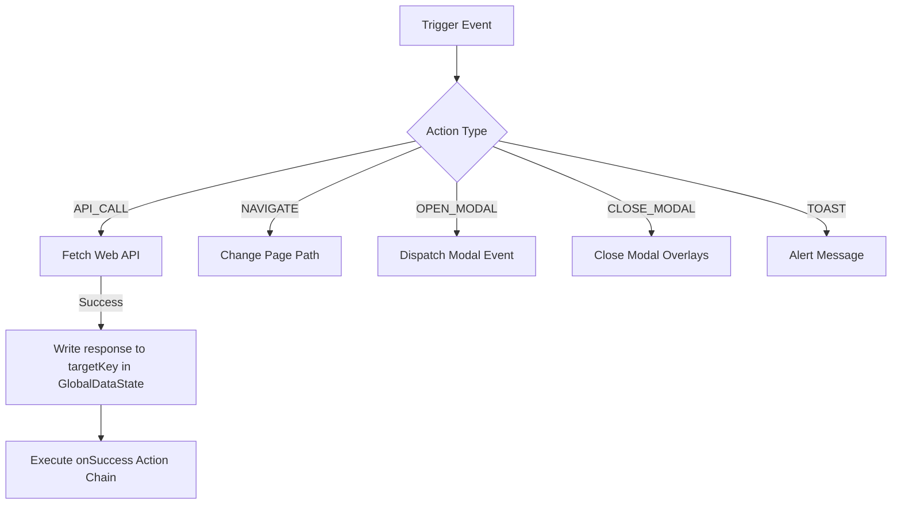
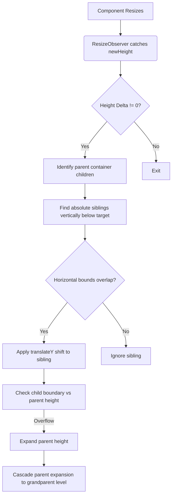

# Antigravity Web: Comprehensive Technical Architecture & Runtime Documentation

`antigravity-web` is the high-fidelity, WebAssembly-compiled runtime rendering engine for the visual builder ecosystem. Built on **Rust** and **Dioxus (v0.7)**, it is responsible for fetching compiled package/page JSON, parsing, data-binding, and reactively rendering interactive component trees.

This guide details every subsystem, data structure, layout mechanism, and component visualizer in the project.

---

## 📂 Project Architecture

```text
antigravity-web/
├── Cargo.toml          # Project dependencies (Serde, Dioxus, Gloo-timers, Web-sys)
├── Dioxus.toml         # Build target configuration settings
└── src/
    ├── main.rs         # Application entry point, global CSS generation, state context providers
    ├── models.rs       # Layout representation structs, deserializers, default node definitions
    ├── renderer.rs     # Hierarchical switchboard, action dispatcher, string/json template binders
```

---

## 🏗️ 1. Main Entrypoint & Initialization (`src/main.rs`)

### Build-Time Environment Hydration
To keep runtime fetch configuration available in WASM, the project uses a build script (`build.rs`) that reads `.env` and exports variables into the compiled binary via `cargo:rustc-env`.

Primary keys:
- `API_BASE_URL` (default: `http://localhost:8080`)
- `COMPILE_ID` (required)
- `PROJECT_ID` (reserved for backend compatibility)
- `HOSTED_BASE_PATH` (optional path prefix for hosted deployments)

Because these values are compile-time injected, changing `.env` requires rebuilding/restarting the app.

### Mounting the Dioxus Application
The `main()` function launches the Dioxus virtual DOM engine with the `App` component:
```rust
fn main() {
    dioxus::launch(App);
}
```

### Runtime Bootstrap Flow
On initialization, the root `App` component:
1. Validates `COMPILE_ID`.
2. Fetches compiled package JSON from:
    `GET /api/compiler/package/{compileId}`
3. Builds route mappings and page cache from package payload.
4. Resolves current URL path to a page ID.
5. Lazy-fetches missing pages from:
    `GET /api/compiler/page/{compileId}/{pageId}`

### Context Providers & Application State
After successful bootstrap, the app mounts global state signals using Dioxus context providers:
- **`GlobalDataState`**: A shared signal storing a `serde_json::Value` object that holds variables, form values, and API responses.
- **`RepeaterItemState`**: A scoped context containing local item data when rendering elements inside list/grid loops.
- **`ParentLayoutContext`**: Tracks whether the parent element uses flow layout or absolute coordinate positioning.
- **`ActiveBreakpointContext`**: Reactively monitors the active screen width breakpoint (`"desktop"`, `"tablet"`, or `"mobile"`).

### Root Life-Cycle Actions (`onLoad`)
Any event actions defined under the root node's `on_load` block are spawned and dispatched asynchronously when the app mounts:
```rust
let on_load_actions = node.on_load.clone();
use_effect(move || {
    let ol = on_load_actions.clone();
    spawn(async move {
        renderer::execute_actions(ol, data_state, None).await;
    });
});
```

### Global Styling Engine (`generate_global_css`)
`main.rs` extracts all computed style properties starting with `--` from the active page root node:
1. Compiles them into a global CSS `:root` stylesheet block.
2. Appends standard scrollbar designs, micro-hover animations, scaling rules, and focus styles.
3. Injects them dynamically into the document head via a `<style>` tag.

---

## 📋 2. Deserialization & Structural Models (`src/models.rs`)

`models.rs` defines the strict Rust representation of the visual layout schema.

### Multipage Package Models
To support route-aware runtime loading, the schema also defines package-level structs:
- `CompiledPackage` (top-level package payload)
- `RoutesIndex` and `RouteRecord` (route path to page mapping)
- `Page` (page metadata + root `ComponentNode`)

### Core Data Models

#### `LayoutMode` Enum
Controls how child components are positioned within a parent component:
```rust
pub enum LayoutMode {
    Absolute,   // Arbitrary X/Y placements based on margins/coordinates
    FlexStack,  // Dynamic, flexible row/column layouts
    CSSGrid,    // Grid-based row/column templates
    Section,    // Full-width layout strip sections
}
```

#### `ComponentNode` Struct
The primary recursive node representing a component and its children:
```rust
pub struct ComponentNode {
    pub id: String,
    pub component_type: String,
    pub template_key: Option<String>,
    pub props: NodeProps,
    pub children: Vec<ComponentNode>,
    pub is_dynamic: bool,
    pub placement: Option<Placement>,
    pub placement_desktop: Option<Placement>,
    pub placement_tablet: Option<Placement>,
    pub placement_mobile: Option<Placement>,
    pub computed_styles: Option<HashMap<String, String>>,
    pub layout_mode: LayoutMode,
    pub anchor: Option<AnchorConstraints>,
    pub size_mode: Option<String>,
    pub grid_area: Option<String>,
    pub on_click: Vec<serde_json::Value>,
    pub on_load: Vec<serde_json::Value>,
    pub on_change: Vec<serde_json::Value>,
    pub on_submit: Vec<serde_json::Value>,
}
```

#### `NodeProps` Struct
A unified container for properties across all 73 component variants. To accommodate different schemas seamlessly:
- Uses `Option<T>` for known property keys (like `text`, `label`, `direction`, `live`, etc.).
- Deserializes `style` dynamically into `Option<HashMap<String, String>>`.
- Flattens all unrecognized keys into an `extra` `HashMap<String, serde_json::Value>` map using `#[serde(flatten)]`.

---

## ⚡ 3. Data Binding & Templating Engine (`src/renderer.rs`)

`renderer.rs` provides dynamic content evaluation, binding layout templates to runtime state variables.

### The Double Curly-Braces Bindings (`{{ ... }}`)
Any string prop can reference dynamic values using double curly-brace syntax. The rendering engine parses and replaces these expressions on the fly:

1. **Local Scope (`item.*`)**:
   - Syntax: `{{ item.fieldName }}`
   - Looks up properties inside the current active loop/list item context.
2. **Global Scope (`data.*` or raw variables)**:
   - Syntax: `{{ data.variableName }}` or `{{ variableName }}`
   - Resolves values from the application-wide `GlobalDataState` signal.

### Dynamic Resolution Methods

- **`resolve_string_templates`**: Scans a string for `{{` and `}}` markers, extracts the target path, evaluates the query, and replaces the marker with the stringified result.
- **`resolve_json_path`**: Traverses JSON paths using dot notation and parses index access operators (e.g., `results.items[0].title`).
- **`resolve_json_templates`**: Recursively traverses deep JSON objects/arrays and interpolates nested strings with dynamic variables.
- **`resolve_array_path`**: Evaluates paths designed to yield array structures, supplying data-sources to loop repeaters.

---

## 🎬 4. Event Action Dispatcher (`src/renderer.rs`)

Interactive elements trigger action workflows by executing arrays of JSON events sequentially.

### Core Handler: `execute_actions`
Runs events asynchronously and maps them to one of the following operations:



#### `API_CALL`
- Sends HTTP requests (supporting `GET`, `POST`, `PUT`, `DELETE` methods) using browser-native APIs inside WASM.
- **Mock Fallback Handling**: If the network is offline or the call fails, it implements specialized mocks (e.g. for `get_mongo_master_with_cond` targeting the user's `email` client) to ensure the runtime remains testable offline.
- Writes the parsed output to the user's declared `targetKey` in the `GlobalDataState`.
- Sequentially executes the `onSuccess` action chain.

#### `NAVIGATE`
- Programmatically changes pages via SPA history updates (`history.pushState`) and dispatches `popstate`, allowing route-aware page switching without hard page reload.

#### `OPEN_MODAL` / `CLOSE_MODAL`
- Dispatches custom DOM events (`open-modal` / `close-modal`) to target IDs to trigger animated overlay frames.

#### `TOAST`
- Displays informative modal notifications or browser alerts.

---

## 🎨 5. Component Renderer & Visual Styles (`src/renderer.rs`)

`ComponentRenderer` acts as the layout switchboard, delegating node configurations to visual renderers.

### The Responsive Coordinate Resolution
For layout nodes positioned absolutely, coordinate offsets (`top`, `left`, `right`, `bottom`) are resolved reactively depending on the current viewport width context:
1. **`mobile`** (falls back to `tablet` → `desktop`)
2. **`tablet`** (falls back to `desktop`)
3. **`desktop`**

### Structure of Visual Components (73 Categories)

```
┌─────────────────────────────────────────────────────────────────┐
│ Structural Layout (Section, Grid, Flex, Card, Stack)            │
│  ┌───────────────────────────────────────────────────────────┐  │
│  │ Interactive Panel (Tabs, Sidebar, Aside, Modal)           │  │
│  │  ┌─────────────────────────────────────────────────────┐  │  │
│  │  │ Dashboard Widgets (Kanban, TimeViewer, Chat, Tables)│  │  │
│  │  │  ┌──────────────────────────────────────────────┐   │  │  │
│  │  │  │ Form Input Elements (DatePicker, OTP, Color) │   │  │  │
│  │  │  └──────────────────────────────────────────────┘   │  │  │
│  │  └─────────────────────────────────────────────────────┘  │  │
│  └───────────────────────────────────────────────────────────┘  │
└─────────────────────────────────────────────────────────────────┘
```

#### Structural Layout Containers
- **`Section`**: Standard block-level sections that span 100% width.
- **`Flex`**: Implements custom CSS flex box layouts (`flex-direction`, `justify-content`, `align-items`, `gap`).
- **`Grid`**: Generates multi-column CSS grid cells.
- **`Card`**: Styled container boards with background shadows, margins, and borders.
- **`List` / Repeaters**: Evaluates a `repeaterDataSource` array, loops through each entry, establishes a localized `RepeaterItemState` context, and renders children repeatedly.

#### Interactive Input Forms
- **`Input` / `Textarea`**: Custom input fields bound to the global state through `bind` property paths, updating data values reactively `onChange`.
- **`Checkbox` / `Toggle` / `Switch`**: Stateful toggles executing click actions and updating bound boolean state keys.
- **`OtpInput`**: Renders multiple character boxes. Uses browser DOM refs in JavaScript to automatically switch focus to the next input cell when a key is pressed.
- **`TagInput`**: Multi-tag creator box with selection suggestions, tag caps, and click removals.
- **`ColorPicker`**: Selectable swatch color boards.
- **`SignaturePad`**: Canvas-based signing board.
- **`RichTextEditor`**: A fully-featured WYSIWYG editor framework.

#### Dashboard Widgets
- **`TimeViewer`**: A digital clock widget that updates every second using a clean `gloo_timers::future::Interval` loop:
  ```rust
  use_effect(move || {
      spawn(async move {
          while interval.next().await.is_some() {
              // Fetch local system time and update signal
          }
      });
  });
  ```
- **`KanbanBoard`**: Styled columns (Todo, In Progress, Done) containing draggable cards.
- **`ChatViewer` / `CommentSection`**: Message threads with colored message bubbles, sender avatars, and input submit actions.
- **`ImageGallery` / `PlaylistPlayer`**: Interactive media selectors switching main image viewers or audio tracks.

---

## ⚡ 6. Hierarchical Smart Layout Engine (JavaScript Component)

To support drag-and-drop visual building alongside runtime content changes, a JavaScript-based layout engine operates under the hood. It ensures that when absolute elements grow, siblings are pushed down, and parent containers expand without breaking the layout.



### Scoped Containment Registry
The engine keeps track of parent-child relationships through scoped maps:
- `containerChildren`: Maps each container element to a `Set` of its direct absolute children.
- `displacementMap`: Tracks displacement offsets per container to prevent coordinate corruption in nested layouts.

---

## 🧭 7. Multipage Routing and Hosted Prefix Handling

The route resolver supports both direct and hosted deployments.

### Route Matching Order
1. Exact path match.
2. Parameterized path match (e.g. `/blog/{id}` or `/blog/:id`).
3. Default route (`/`) fallback.

### Hosted Base Path Support
If `HOSTED_BASE_PATH` is configured (e.g. `/user_page`), route resolution strips that prefix from the browser pathname before matching package routes. This keeps route mapping stable across root and subpath deployments.

### Lazy Page Cache
If a route points to a page ID that was not included in the initial package pages map, the page is fetched on demand and inserted into an in-memory cache to prevent repeated network fetches during the same session.

### Vertical Push-Down & Horizontal Overlap Check
When an element resizes:
1. Calculates height differences (`newHeight - oldHeight`).
2. Scopes actions to direct siblings in `containerChildren`.
3. Verifies if sibling positions are vertically below the target.
4. Performs a horizontal projection check:
   ```javascript
   function horizontalOverlap(r1, r2) {
     return r1.left < r2.right && r1.right > r2.left;
   }
   ```
5. Applies visual displacement transforms using CSS `translateY` to avoid altering the core database layout coordinates.

### Cascading Parent Expansion
If a child exceeds the bottom edge of its container (`childBottom > parentHeight`):
1. Expands the parent container's height.
2. Recursively calls `cascadeParentExpansion` to push down the parent's own siblings at the grandparent level.

### Restoration of Displacements (Anti-Flicker)
A MutationObserver monitors inline styling changes. When Dioxus updates the virtual DOM and resets style properties:
- The observer catches style changes.
- Automatically restores any active translation offsets immediately to prevent visual layout flicker.
